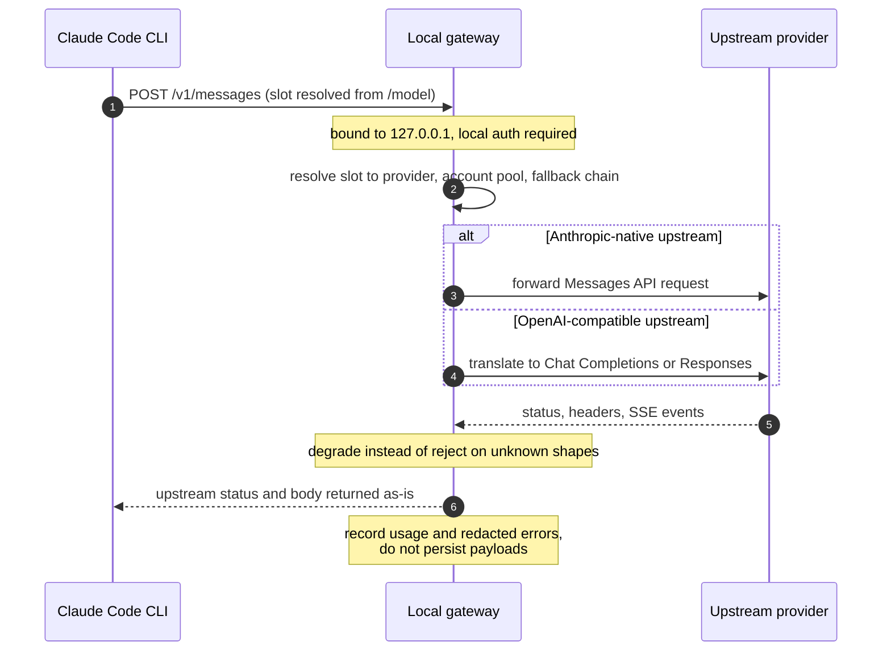
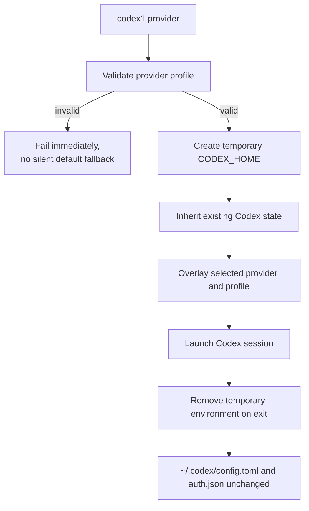

<div align="center">


# Agent-Hub

**Your agents. Your providers. One local hub.**

A local runtime for Claude Code and Codex.

Manage providers in one place, route Claude Code across different models,
and launch isolated Codex sessions without rewriting your normal configuration.

[English](README.md) · [简体中文](README.zh-CN.md)

[](https://github.com/Aley3567/Agent-Hub/actions/workflows/tests.yml)
[](pyproject.toml)
[](https://docs.astral.sh/uv/)
[](pyproject.toml)
[](tests)
[](LICENSE)

[Get started](#get-started) · [Capabilities](#capabilities) · [Architecture](#architecture) · [Changelog](CHANGELOG.md)

</div>

---

Agent-Hub is a local runtime that owns the layer *around* your coding agent:
providers, sessions, routing, protocol translation and observability.

**Providers live in Hub's own database.** Nothing else needs to be running or
installed for normal use.

Provider management and session launching currently have separate terminal
entrypoints. See [current boundaries](#current-boundaries) before choosing an
interface.

## Where Agent-Hub fits

Agent-Hub does not replace your coding agents.

They remain responsible for reasoning, tools, permissions and execution.
Agent-Hub manages the layer around them: providers, sessions, routing,
protocol translation and observability.

| | Claude Code | Codex |
| :--- | :--- | :--- |
| Provider management | Shared Agent-Hub store | Shared Agent-Hub store |
| Session isolation | Yes | Yes |
| Model switching | Native `/model` routes | Codex-native model selection |
| Local gateway | Yes | No |
| Protocol translation | Anthropic / OpenAI | No |
| Pools and fallback | Yes | No |

The two paths are intentionally different: Claude Code can use the Agent-Hub
gateway, while Codex keeps its native runtime and receives only an isolated
session configuration.

## Architecture

Agent-Hub sits beside the coding agent, not inside its agent loop.

Your coding agents continue to own reasoning and execution. Agent-Hub owns
provider selection, session isolation, routing and protocol handling.

<picture>
  <source media="(prefers-color-scheme: dark)" srcset="assets/brand/agent-hub/architecture-dark.svg">
  <source media="(prefers-color-scheme: light)" srcset="assets/brand/agent-hub/architecture.svg">
  
</picture>

### The Claude Code request path



### The Codex session lifecycle



The root Python modules own the request path and protocol semantics. Rust
provides the management plane; the desktop interfaces are separate macOS and
Windows builds. The Go gateway is an independent experiment.

Read the [request-flow guide](docs/request-flow.md) for actual entrypoints, data
flow and retry boundaries. The Python package console scripts under
`src/claude_hub/` are help/version placeholders; use the installation above for
working session launchers.

## Capabilities

### Route models in Claude Code

Bind Fable, Opus, Sonnet and Haiku slots to different providers and models.
Switch between them with Claude Code's native `/model` command.

### Bridge provider APIs

Use Anthropic-native upstreams directly, or translate Claude Code traffic to
OpenAI Chat Completions and Responses, including streaming and tool calls.

### Define fallback paths

Configure fallback routes and compatible account pools with explicit retry and
replay boundaries.

### Inspect runtime behavior

Review token usage, cache behavior, provider attribution and redacted gateway
failures without storing complete request or response bodies.

### Launch isolated Codex sessions

Select a provider for one Codex session through a temporary `CODEX_HOME`. Your
normal Codex configuration and credentials remain untouched.

### Manage providers once

Add providers directly to Agent-Hub or import compatible records from JSON.

## Get started

### macOS preview package

The first Apple Silicon desktop preview is **0.2.2**. Download the `.pkg`
installer from [GitHub Releases](https://github.com/Aley3567/Agent-Hub/releases),
verify its SHA-256 against `SHA256SUMS.txt`, quit Agent Hub and double-click the
installer. It installs the desktop app in Applications and the management CLI
and Python runtime for the signed-in user.

Python 3.11+, Claude Code and `uv` remain external prerequisites. Install the
Codex CLI separately for Codex sessions.

### Build from source

Targets **macOS and Linux**. You need Python 3.11+, zsh, Rust/Cargo and Claude
Code available as `claude`. Install the Codex CLI separately for Codex sessions.
The gateway and protocol conversion also require `uv`.

```bash
git clone https://github.com/Aley3567/Agent-Hub.git
cd Agent-Hub
cargo install --path crates/agent-hub --locked
./install.sh
source ~/.zshrc
```

Ensure Cargo's binary directory (normally `~/.cargo/bin`) is on your `PATH`. The
installer backs up replaced files, installs the Python runtime under `~/.claude`
and `~/.codex/scripts`, and adds managed shell integration to `~/.zshrc`. It
creates Hub's provider database.

### Add a provider

```bash
agent-hub
```

Press `a` to add or update a provider, `f` to import JSON, or `r` to reload
Hub's local configuration. API key input is hidden.

The same operations are available from the CLI:

```bash
agent-hub provider add
agent-hub provider list
```

Preview an import before applying it:

```bash
agent-hub provider import --file /path/to/providers.json --preview
agent-hub provider import --file /path/to/providers.json
```

Imports preserve existing entries by default. Use `--replace` only to update
matching provider IDs. See [provider management](docs/provider-management.md)
for the JSON format and storage overrides.

### Launch a session

```bash
claude1    # Claude Code: choose a provider, then press Enter
codex1     # Codex: choose a provider for this session
```

`claude1` and `codex1` are the launcher command names within Agent-Hub. The
`agent-hub` TUI currently manages providers; it does not launch sessions on
Enter.

For Claude Code gateway routing, open `claude1` and press `a` or `n` to create a
named Hub, then configure its channels and model slots. Once configured,
`claude1 hub` starts the default Hub; use `/model` inside Claude Code to switch
models. Each named Hub has its own configuration, port and usage records.

## Everyday commands

| Command | Purpose |
| :--- | :--- |
| `agent-hub` | Open provider management |
| `agent-hub provider list --json` | List providers without exposing credentials |
| `agent-hub provider import --file /path/to/providers.json --preview` | Preview a file import |
| `claude1 <name>` | Launch Claude Code with a named provider |
| `claude1 id:<provider-id>` | Select a provider by stable ID |
| `claude1 direct` | Launch native Claude Code directly |
| `claude1 hub --slot sonnet` | Start the default Hub with a chosen slot |
| `claude1 usage --week` | Inspect the last seven days of usage |
| `claude1 doctor` | Check local configuration without contacting providers |
| `~/.claude/scripts/claude-hub.py errors` | Read recent redacted gateway errors |
| `codex1 --list` | List Codex providers |
| `codex1 <name> -- <codex args>` | Select a provider and forward CLI arguments |

Use `claude1 --help` and `agent-hub --help` for more commands. Gateway and
account pool configurations are in [`examples/`](examples/).

## Codex

Agent-Hub keeps Codex close to its native configuration model.

For each launch, `codex1` creates a temporary `CODEX_HOME`, inherits the user's
existing Codex state, overlays the selected provider, and removes the temporary
environment when the session exits.

The real `~/.codex/config.toml` and `~/.codex/auth.json` are not modified.

Generated profiles are validated before launch. Invalid or incomplete
configuration fails immediately instead of silently falling back to the default
provider.

Codex sessions currently do not use the Agent-Hub gateway, protocol bridge,
account pools or fallback routing.

## Local and security model

Agent-Hub keeps its control plane local.

- Provider state is stored on the local machine.
- The gateway binds to `127.0.0.1`.
- Credentials are excluded from normal CLI and desktop responses.
- Error records are credential-redacted.
- Runtime metrics contain operational metadata, not full message content.
- Complete request and response payloads are not persisted in gateway logs.

## Testing

Agent-Hub tests the boundaries where routing errors are most expensive:
protocol conversion, streaming, session isolation and configuration handling.

- 1,010 Python tests across macOS and Ubuntu with Python 3.11 and 3.12
- Rust workspace tests for the management plane
- macOS backend tests, type checks and production builds in CI
- shell integration and installer tests
- repository secret scanning before the test suite runs
- Ruff undefined-name and duplicate-definition checks before the test suite runs

See the [CI workflow](.github/workflows/tests.yml),
[protocol status](docs/anthropic-protocol-implementation-status.md) and
[changelog](CHANGELOG.md) for the current validation surface.

## Current boundaries

The current desktop release targets Apple Silicon macOS and is ad-hoc signed,
not Apple-notarized.

Claude Code supports gateway routing, protocol translation, pools and fallback.
Codex currently uses isolated provider launches without the gateway.

Scheduled desktop actions run while Agent-Hub is open.

Windows source is maintained separately; no Windows installer is currently
published.

## Configuration and security

- **Provider storage:** `~/.agent-hub/providers.db`, with `0600` permissions.
  Credentials are stored locally and excluded from provider list output and
  desktop IPC responses.
- **Explicit imports:** Imported records belong to Hub and do not refresh
  automatically from the source.
- **Session isolation:** Claude Code receives session-specific environment values
  and temporary settings. Codex uses a temporary shadow `CODEX_HOME` and profile
  overrides. Normal launching leaves the original CLI configuration unchanged.
- **Local gateway:** binds to `127.0.0.1`, requires local authentication, and
  validates private file permissions.
- **Failure reporting:** errors preserve upstream evidence with credential
  redaction. Logs do not store complete request or response payloads; interrupted
  streams are not turned into successful completions.

Existing Hub routing configuration and logs are preserved in place, so
upgrading keeps local state. Explicit legacy database overrides can still point
the runtime at an external database; see
[storage and compatibility](docs/provider-management.md#数据所有权和兼容).

## Contributing

Issues and pull requests are welcome.

- Run the Python suite before opening a pull request:
  `python3 -m unittest discover -s tests -p 'test_*.py'`
- Run `ruff check .` if you have Ruff installed; CI runs it with the pinned
  version and the rule set declared in `pyproject.toml`.
- Protocol changes must come with tests. The repository's protocol invariants
  are documented in [CLAUDE.md](CLAUDE.md).
- Do not include credentials, real provider endpoints or private account data in
  issues, pull requests or test fixtures.

The maintainer reviews pull requests and triages issues in
[GitHub Issues](https://github.com/Aley3567/Agent-Hub/issues). Releases are
tagged with a changelog entry; see [CHANGELOG.md](CHANGELOG.md).

## Development

```bash
python3 -m pip install 'aiohttp>=3.9' 'certifi>=2024.2.2'
python3 -m unittest discover -s tests -p 'test_*.py'
cargo test -p agent-hub --locked
./tests/test_shell_integration.zsh
./tests/test_install.zsh
```

| Guide | Contents |
| :--- | :--- |
| [Provider management](docs/provider-management.md) | Local storage, imports and provider format |
| [Request flow](docs/request-flow.md) | Runtime entrypoints, protocol boundaries and retry behavior |
| [Protocol support](docs/anthropic-protocol-implementation-status.md) | Compatibility and known limitations |
| [Desktop builds](UI/README.md) | macOS and Windows development |
| [Project rules](CLAUDE.md) | Protocol invariants and documentation index |

Most detailed engineering documents are currently in Chinese.

## License

[MIT](LICENSE)
