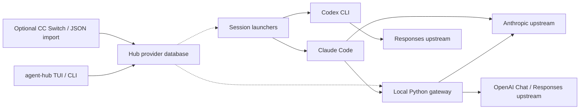

<div align="center">


# Agent-Hub

**Your agents. Your providers. One local hub.**

Manage providers for Claude Code and Codex. Route models through a local gateway. Keep each session's configuration separate.

[English](README.md) · [简体中文](README.zh-CN.md)

[](https://github.com/Aley3567/Agent-Hub/actions/workflows/tests.yml)
[](LICENSE)

[Get started](#get-started) · [Capabilities](#capabilities) · [Architecture](#architecture) · [Changelog](CHANGELOG.md)

</div>

---

Agent-Hub brings provider management, session launchers and model routing together on your machine. Add your own providers or import existing configurations, then use them with your coding CLI.

**CC Switch is optional.** Providers live in Hub's own database. Importing from CC Switch is an explicit operation; normal use does not depend on it running or staying installed.

The project is under active development. Provider management and session launching currently have separate terminal entrypoints. See [current scope](#current-scope) before choosing an interface.

## Capabilities

| | What you can do today |
| :--- | :--- |
| **Own your provider configuration** | Add Claude Code and Codex providers through the TUI or CLI. Import from CC Switch or JSON with a preview and explicit replacement of existing entries. |
| **Launch isolated sessions** | Choose a provider for a session without switching the ordinary CLI's persistent provider configuration. |
| **Switch models inside Claude Code** | Use the local gateway with native `/model` selection. Bind Fable, Opus, Sonnet and Haiku slots to different providers and models. |
| **Connect different APIs** | Use Anthropic upstreams or translate Claude Code requests to OpenAI Chat Completions and Responses, including streaming and tool calls. |
| **Configure fallback and account pools** | Declare fallback routes and rotate compatible accounts. Retry and replay boundaries are explicit; interrupted responses are never presented as completed. |
| **Inspect usage and failures** | View token usage, cache metrics and redacted error records. The macOS app adds time ranges, provider breakdowns and paginated request details. |

Agent-Hub manages connections and routing. Claude Code and Codex remain responsible for their agent loops, tools and permission prompts.

## Get started

### macOS preview package

The first Apple Silicon desktop preview is **0.2.1**. Download the `.pkg` installer
from [GitHub Releases](https://github.com/Aley3567/Agent-Hub/releases), verify its
SHA-256, quit Agent Hub and double-click the installer. It installs the desktop app
in Applications and the management CLI and Python runtime for the signed-in user. Python 3.11+, Claude Code and `uv` remain external prerequisites;
install Codex CLI separately for Codex sessions.

This preview is ad-hoc signed and **not Apple notarized**. macOS may require an
explicit approval in Privacy & Security after you verify the download. It does
not include Intel Mac or Windows binaries. Scheduled tasks run only while the app
is open; chat requires a configured, running local Hub.

### Build from source

The source installation below targets **macOS and Linux**. You need Python 3.11+, zsh, Rust/Cargo and Claude Code available as `claude`. Install Codex CLI separately for Codex sessions. The gateway and protocol conversion also require `uv`.

### 1. Install the terminal tools

```bash
git clone https://github.com/Aley3567/Agent-Hub.git
cd Agent-Hub
cargo install --path crates/agent-hub --locked
./install.sh
source ~/.zshrc
```

Ensure Cargo's binary directory (normally `~/.cargo/bin`) is on your `PATH`. The installer backs up replaced files, installs the Python runtime under `~/.claude` and `~/.codex/scripts`, and adds managed shell integration to `~/.zshrc`. It creates Hub's provider database without requiring CC Switch.

### 2. Add a provider

```bash
agent-hub
```

In the provider TUI, press `a` to add or update a provider, `i` to import from CC Switch, `f` to import JSON, or `r` to reload Hub's local configuration. API key input is hidden.

The same operations are available from the CLI:

```bash
agent-hub provider add
agent-hub provider list
```

For an existing CC Switch setup, preview before importing:

```bash
agent-hub provider import --cc-switch --preview
agent-hub provider import --cc-switch
```

Imports preserve existing entries by default. Use `--replace` only to update matching provider IDs. See [provider management](docs/provider-management.md) for the JSON format and storage overrides.

### 3. Launch a session

```bash
# Claude Code: choose a provider, then press Enter
claude1

# Codex: choose a provider for this session
codex1
```

`claude1` and `codex1` are the existing launcher command names within Agent-Hub. The `agent-hub` TUI currently manages providers; it does not launch sessions on Enter.

For Claude Code gateway routing, open `claude1`, press `a` or `n` to create a named Hub, and configure its channels and model slots. Once configured, `claude1 hub` starts the default Hub; use `/model` inside Claude Code to switch models. Each named Hub has its own configuration, port and usage records.

## Everyday commands

| Command | Purpose |
| :--- | :--- |
| `agent-hub` | Open provider management |
| `agent-hub provider list --json` | List providers without exposing credentials |
| `agent-hub provider import --file /path/to/providers.json --preview` | Preview a file import |
| `claude1 <name>` | Launch Claude Code with a named provider |
| `claude1 id:<provider-id>` | Select a provider by stable ID |
| `claude1 direct` | Launch native Claude Code directly |
| `claude1 hub --slot sonnet` | Start the default Hub with a chosen slot |
| `claude1 usage --week` | Inspect the last seven days of usage |
| `claude1 doctor` | Check local configuration without contacting providers |
| `~/.claude/scripts/claude-hub.py errors` | Read recent redacted gateway errors |
| `codex1 --list` | List Codex providers |
| `codex1 <name> -- <codex args>` | Select a provider and forward CLI arguments |

Use `claude1 --help` and `agent-hub --help` for more commands. Gateway and account pool configurations are in [`examples/`](examples/).

## Architecture



The root Python modules own the request path and protocol semantics. Rust provides the management plane; the desktop interfaces are separate macOS and Windows builds. The Go gateway is an independent experiment.

Read the [request-flow guide](docs/request-flow.md) for actual entrypoints, data flow and retry boundaries. The Python package console scripts under `src/claude_hub/` are help/version placeholders; use the installation above for working session launchers.

## Configuration and security

- **Provider storage:** `~/.agent-hub/providers.db`, with `0600` permissions. Credentials are stored locally and excluded from provider list output and desktop IPC responses.
- **Explicit imports:** CC Switch is read only when requested for import. Imported records belong to Hub and do not refresh automatically from the source.
- **Session isolation:** Claude Code receives session-specific environment values and temporary settings. Codex uses a temporary shadow `CODEX_HOME` and profile overrides. Normal launching leaves the original CLI configuration unchanged.
- **Local gateway:** binds to `127.0.0.1`, requires local authentication, and validates private file permissions.
- **Failure reporting:** errors preserve upstream evidence with credential redaction. Logs do not store complete request or response payloads; interrupted streams are not turned into successful completions.

Existing Hub routing configuration and logs remain under `~/.cc-switch/` to preserve local state. The directory name does not imply a CC Switch dependency. Explicit legacy database overrides can still point the runtime at an external database; see [storage and compatibility](docs/provider-management.md#数据所有权和兼容).

## Current scope

| Surface | Status |
| :--- | :--- |
| Provider TUI / CLI | Add, list and explicitly import Claude Code and Codex providers |
| Session launchers | Separate launchers; gateway model switching applies to Claude Code |
| macOS desktop | 0.2.1 Apple Silicon preview: provider management, usage analysis, bilingual settings, PR inbox, local Hub chat and in-app scheduling; ad-hoc signed, not notarized |
| Windows desktop | Separate source tree; the 0.2.1 delivery did not include a Windows installer |
| Unified terminal workflow | Further integration of provider management and session launching remains development work |
| Agent orchestration | Desktop chat uses the local Hub; scheduled actions require the app to remain open. This is not a background orchestration service |

The bilingual README does not mean the terminal and desktop interfaces are fully translated. See the [work queue](docs/work-queue.md) for delivery evidence and remaining work, and the [changelog](CHANGELOG.md) for a concise record of changes.

## Development

```bash
python3 -m pip install 'aiohttp>=3.9' 'certifi>=2024.2.2'
python3 -m unittest discover -s tests -p 'test_*.py'
cargo test -p agent-hub --locked
./tests/test_shell_integration.zsh
./tests/test_install.zsh
```

| Guide | Contents |
| :--- | :--- |
| [Provider management](docs/provider-management.md) | Local storage, imports and provider format |
| [Request flow](docs/request-flow.md) | Runtime entrypoints, protocol boundaries and retry behavior |
| [Protocol support](docs/anthropic-protocol-implementation-status.md) | Compatibility and known limitations |
| [Desktop builds](UI/README.md) | macOS and Windows development |
| [Project rules](CLAUDE.md) | Protocol invariants and documentation index |

Most detailed engineering documents are currently in Chinese.

## License

[MIT](LICENSE)
