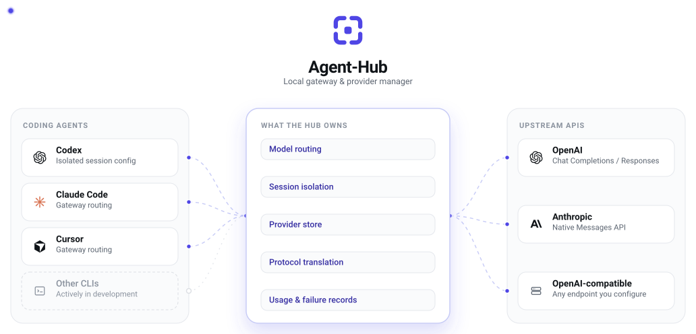
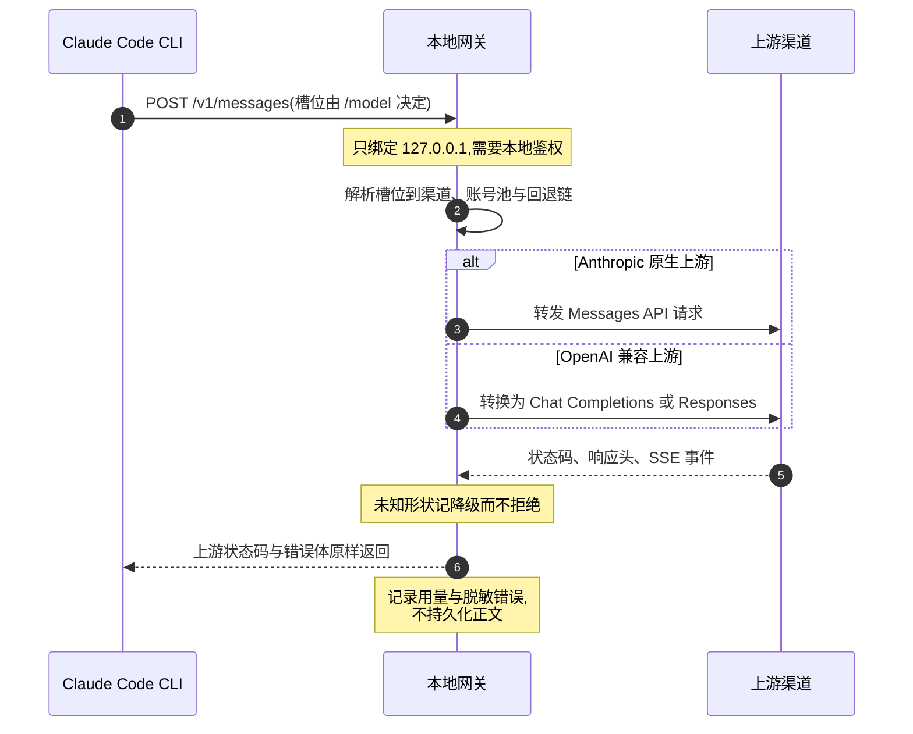
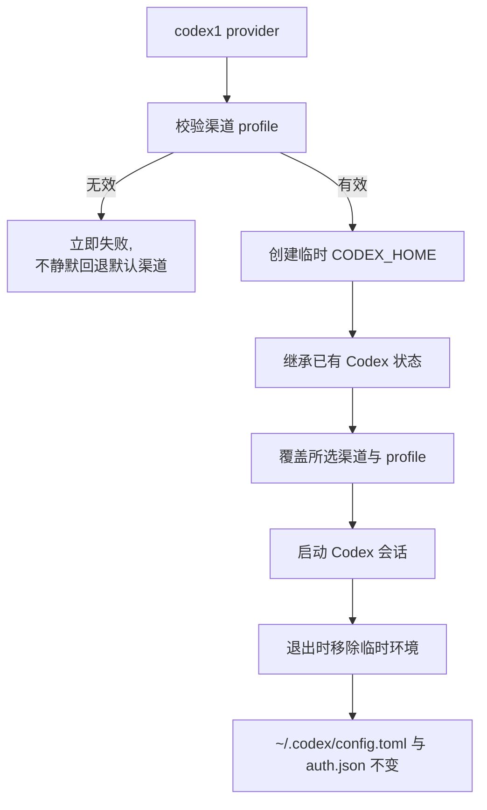

<div align="center">


# Agent-Hub

**你的 Agent，你的渠道，一个本地工作入口。**

Claude Code 与 Codex 的本机运行时。

在一处管理渠道，让 Claude Code 在 Anthropic 与 OpenAI 兼容 API 之间路由，
并为 Codex 启动隔离会话，而无需改写你原有的配置。

[English](README.md) · [简体中文](README.zh-CN.md)

[](https://github.com/Aley3567/Agent-Hub/actions/workflows/tests.yml)
[](pyproject.toml)
[](https://docs.astral.sh/uv/)
[](pyproject.toml)
[](tests)
[](LICENSE)

[快速开始](#快速开始) · [为什么需要 Agent-Hub](#为什么需要-agent-hub) · [架构](#架构) · [更新记录](CHANGELOG.zh-CN.md)

</div>

---

Agent-Hub 是管理编程 Agent **周边那一层**的本机运行时：渠道、会话、路由、
协议转换与可观测性。

**渠道保存在 Hub 自有数据库中。** 日常使用不要求任何外部工具运行或保持安装。

渠道管理和会话启动目前使用独立的终端入口。选择入口前可先查看[当前边界](#当前边界)。

## 为什么需要 Agent-Hub

编程 Agent 已经负责推理、工具、权限与执行。Agent-Hub 专注于它们周边的运行层，
让渠道与路由变化不需要替换 agent loop，也不需要反复改写全局配置。

- **保持 Agent 原生运行。** Claude Code 与 Codex 继续使用各自原生运行时；
  Agent-Hub 位于它们旁边，而不是 fork 或接管执行模型。
- **渠道只管理一次。** 渠道状态保存在统一的本地存储中，可复用于隔离会话。
- **只在需要的位置做协议转换。** Claude Code 可接入 Anthropic 原生或 OpenAI
  兼容上游；Codex 保持原生运行时，并使用隔离的 `CODEX_HOME` 路径。
- **本地优先。** 控制面保留在本机，常规响应不暴露凭证，网关日志不持久化完整
  消息正文。

## Agent-Hub 的位置

两条运行路径刻意保持不同：Claude Code 可以使用本地网关与协议桥，Codex 则尽量
贴近其原生配置模型。

| | Claude Code | Codex |
| :--- | :--- | :--- |
| 渠道管理 | 共用的 Agent-Hub 存储 | 共用的 Agent-Hub 存储 |
| 会话隔离 | 是 | 是 |
| 模型切换 | 原生 `/model` 路由 | Codex 原生模型选择 |
| 本地网关 | 是 | 否 |
| 协议转换 | Anthropic / OpenAI | 否 |
| 账号池与回退 | 是 | 否 |

两条路径刻意不同：Claude Code 可以使用 Agent-Hub 网关，Codex 保留其原生运行时，
只接收一份隔离的会话配置。

## 架构

Agent-Hub 位于编程 Agent 旁边，而不是进入它的 agent loop。

编程 Agent 继续负责推理与执行。Agent-Hub 负责渠道选择、会话隔离、
路由与协议处理。

<picture>
  <source media="(prefers-color-scheme: dark)" srcset="assets/brand/agent-hub/architecture-dark.svg">
  <source media="(prefers-color-scheme: light)" srcset="assets/brand/agent-hub/architecture.svg">
  
</picture>

### Claude Code 的请求路径



### Codex 会话生命周期



根目录 Python 模块拥有请求路径与协议语义。Rust 提供管理面；桌面界面是独立的
macOS 与 Windows 构建。Go 网关是独立实验。

实际的入口、数据流与重试边界见[请求流程指南](docs/request-flow.md)。
`src/claude_hub/` 下的 Python 包 console scripts 是 help/version 占位，可用会话
启动器请使用上面的安装方式。

## 核心能力

### 在 Claude Code 中路由模型

把 Fable、Opus、Sonnet、Haiku 四个槽位绑定到不同渠道和模型，用 Claude Code
原生的 `/model` 命令切换。

### 桥接渠道 API

直接使用 Anthropic 原生上游，或把 Claude Code 的流量转换为 OpenAI Chat
Completions 与 Responses，包括流式输出与工具调用。

### 定义回退路径

配置回退路由与兼容账号池，重试与重放的边界是显式的。

### 检视运行态行为

查看 token 用量、缓存表现、渠道归属与脱敏后的网关失败记录，而不保存完整的
请求或响应正文。

### 启动隔离的 Codex 会话

通过临时 `CODEX_HOME` 为单次 Codex 会话选择渠道。你原有的 Codex 配置与凭证
不受影响。

### 渠道只管理一次

直接向 Agent-Hub 添加渠道，或从 JSON 导入兼容记录。

## 快速开始

### macOS 预览包

首个 Apple Silicon 桌面预览版本为 **0.2.2**。从
[GitHub Releases](https://github.com/Aley3567/Agent-Hub/releases) 下载 `.pkg`
安装包，用 `SHA256SUMS.txt` 核对 SHA-256，退出 Agent Hub 后双击安装。安装器会
把桌面应用装入 Applications，并为当前登录用户安装管理 CLI 与 Python 运行时。

Python 3.11+、Claude Code 与 `uv` 仍是外部前置条件。Codex 会话需另行安装 Codex CLI。

### 从源码构建

面向 **macOS 与 Linux**。需要 Python 3.11+、zsh、Rust/Cargo，以及可执行的
`claude`。Codex 会话需另行安装 Codex CLI。网关与协议转换还需要 `uv`。

```bash
git clone https://github.com/Aley3567/Agent-Hub.git
cd Agent-Hub
cargo install --path crates/agent-hub --locked
./install.sh
source ~/.zshrc
```

确保 Cargo 的二进制目录（通常为 `~/.cargo/bin`）在 `PATH` 中。安装脚本会备份被
替换的文件，把 Python 运行时装到 `~/.claude` 与 `~/.codex/scripts`，并向
`~/.zshrc` 写入受管理的 shell 集成。它会创建 Hub 的渠道数据库。

### 添加渠道

```bash
agent-hub
```

在渠道 TUI 中按 `a` 添加或更新渠道，`f` 导入 JSON，`r` 重新加载 Hub 本地配置。
API key 输入不回显。

同样的操作也提供 CLI：

```bash
agent-hub provider add
agent-hub provider list
```

导入前先预览：

```bash
agent-hub provider import --file /path/to/providers.json --preview
agent-hub provider import --file /path/to/providers.json
```

导入默认保留既有条目。仅在需要更新同 ID 渠道时使用 `--replace`。JSON 格式与
存储覆盖见[渠道管理](docs/provider-management.md)。

### 启动会话

```bash
claude1    # Claude Code：选择渠道后回车
codex1     # Codex：为本次会话选择渠道
```

`claude1` 与 `codex1` 是 Agent-Hub 内的启动器命令名。`agent-hub` TUI 目前只管理
渠道，回车不会启动会话。

需要 Claude Code 网关路由时，打开 `claude1` 按 `a` 或 `n` 新建具名 Hub，再配置
其通道与模型槽位。配置完成后 `claude1 hub` 启动默认 Hub；在 Claude Code 内用
`/model` 切换模型。每个具名 Hub 有各自的配置、端口与用量记录。

## 常用命令

| 命令 | 用途 |
| :--- | :--- |
| `agent-hub` | 打开渠道管理 |
| `agent-hub provider list --json` | 列出渠道，不暴露凭证 |
| `agent-hub provider import --file /path/to/providers.json --preview` | 预览文件导入 |
| `claude1 <name>` | 用具名渠道启动 Claude Code |
| `claude1 id:<provider-id>` | 按稳定 ID 选择渠道 |
| `claude1 direct` | 直接启动原生 Claude Code |
| `claude1 hub --slot sonnet` | 以指定槽位启动默认 Hub |
| `claude1 usage --week` | 查看最近七天用量 |
| `claude1 doctor` | 检查本地配置，不联系上游 |
| `~/.claude/scripts/claude-hub.py errors` | 读取近期脱敏的网关错误 |
| `codex1 --list` | 列出 Codex 渠道 |
| `codex1 <name> -- <codex args>` | 选择渠道并转发 CLI 参数 |

更多命令见 `claude1 --help` 与 `agent-hub --help`。网关与账号池配置在
[`examples/`](examples/)。

## Codex

Agent-Hub 让 Codex 贴近它原生的配置模型。

每次启动时，`codex1` 创建临时 `CODEX_HOME`，继承用户已有的 Codex 状态，覆盖上
所选渠道，并在会话退出时移除临时环境。

真实的 `~/.codex/config.toml` 与 `~/.codex/auth.json` 不会被修改。

生成的 profile 在启动前会先校验。配置无效或不完整会立即失败，而不是静默回退到
默认渠道。

Codex 会话目前不使用 Agent-Hub 网关、协议桥、账号池与回退路由。

## 本地与安全模型

Agent-Hub 的控制面保持在本机。

- 渠道状态保存在本机。
- 网关只绑定 `127.0.0.1`。
- 凭证不出现在常规 CLI 与桌面响应中。
- 错误记录经过凭证脱敏。
- 运行态指标是运维元数据，不是完整消息内容。
- 网关日志不保存完整的请求与响应正文。

## 测试

Agent-Hub 测试的是路由出错代价最高的那些边界：协议转换、流式传输、会话隔离与
配置处理。

- macOS 与 Ubuntu、Python 3.11 与 3.12 上共 1,010 个 Python 测试
- 管理面的 Rust workspace 测试
- CI 中覆盖 macOS 后端测试、类型检查与生产构建
- shell 集成与安装器测试
- 测试套件之前先做仓库密钥扫描
- 测试套件之前先做 Ruff 未定义名与重复定义检查

当前验证面见 [CI 工作流](.github/workflows/tests.yml)、
[协议状态](docs/anthropic-protocol-implementation-status.md)与[更新记录](CHANGELOG.zh-CN.md)。

## 当前边界

当前桌面版本面向 Apple Silicon macOS，为 ad-hoc 签名，未经 Apple 公证。

Claude Code 支持网关路由、协议转换、账号池与回退。Codex 目前只使用隔离渠道启动，
不经过网关。

计划的桌面任务仅在 Agent-Hub 打开时运行。

Windows 源码单独维护；当前不发布 Windows 安装器。

## 配置与安全

- **渠道存储：** `~/.agent-hub/providers.db`，权限 `0600`。凭证保存在本机，且不
  出现在渠道列表输出与桌面 IPC 响应中。
- **显式导入：** 导入的记录归 Hub 所有，不会自动从来源刷新。
- **会话隔离：** Claude Code 接收会话级环境变量与临时设置。Codex 使用临时影子
  `CODEX_HOME` 与 profile 覆盖。常规启动不改动原有 CLI 配置。
- **本地网关：** 只绑定 `127.0.0.1`，需要本地鉴权，并校验私有文件权限。
- **失败上报：** 错误在脱敏凭证的同时保留上游证据。日志不保存完整的请求与响应
  正文；中断的流不会被变成成功完成。

既有 Hub 路由配置与日志原地保留，升级不会丢失本机状态。仍可通过显式的旧库覆盖
把运行时指向外部数据库，见
[存储与兼容](docs/provider-management.md#数据所有权和兼容)。

## 参与贡献

欢迎提交 issue 与 pull request。

- 提交前先跑 Python 测试套件：
  `python3 -m unittest discover -s tests -p 'test_*.py'`
- 装了 Ruff 的话请跑 `ruff check .`；CI 使用固定版本与 `pyproject.toml` 中声明的
  规则集。
- 协议层改动必须补测试。仓库的协议不变量记录在 [CLAUDE.md](CLAUDE.md)。
- 不要在 issue、pull request 或测试夹具里放入凭证、真实上游地址或私有账号信息。

维护者在 [GitHub Issues](https://github.com/Aley3567/Agent-Hub/issues) 中评审
pull request 并做 issue 分类。发布带 tag 并配一条更新记录，见
[CHANGELOG.zh-CN.md](CHANGELOG.zh-CN.md)。

## 开发

```bash
python3 -m pip install 'aiohttp>=3.9' 'certifi>=2024.2.2'
python3 -m unittest discover -s tests -p 'test_*.py'
cargo test -p agent-hub --locked
./tests/test_shell_integration.zsh
./tests/test_install.zsh
```

| 指南 | 内容 |
| :--- | :--- |
| [渠道管理](docs/provider-management.md) | 本地存储、导入与渠道格式 |
| [请求流程](docs/request-flow.md) | 运行时入口、协议边界与重试行为 |
| [协议支持](docs/anthropic-protocol-implementation-status.md) | 兼容性与已知限制 |
| [桌面构建](UI/README.md) | macOS 与 Windows 开发 |
| [项目规则](CLAUDE.md) | 协议不变量与文档索引 |

大部分详细工程文档目前为中文。

## 许可证

[MIT](LICENSE)
