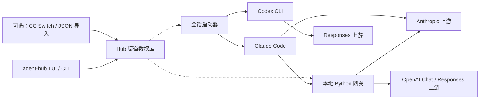

<div align="center">


# Agent-Hub

**你的 Agent，你的渠道，一个本地工作入口。**

管理 Claude Code 与 Codex 的渠道，通过本地网关路由模型，让每次会话的配置各自独立。

[English](README.md) · [简体中文](README.zh-CN.md)

[](https://github.com/Aley3567/Agent-Hub/actions/workflows/tests.yml)
[](LICENSE)

[快速开始](#快速开始) · [核心能力](#核心能力) · [架构](#架构) · [更新记录](CHANGELOG.zh-CN.md)

</div>

---

Agent-Hub 在本机提供渠道管理、会话启动和模型路由。你可以自行添加渠道，也可以导入已有配置，再交给常用的编程 CLI 使用。

**CC Switch 是可选项。** 渠道保存在 Hub 自有数据库中。从 CC Switch 导入需要显式操作；日常使用不要求它运行或保持安装。

项目仍在持续开发。目前渠道管理和会话启动使用独立的终端入口。选择入口前可先查看[当前边界](#当前边界)。

## 核心能力

| | 目前可以做到 |
| :--- | :--- |
| **独立管理渠道** | 通过 TUI 或 CLI 添加 Claude Code、Codex 渠道。从 CC Switch 或 JSON 导入，支持预览和显式覆盖。 |
| **隔离启动会话** | 为一次会话选择渠道，不切换普通 CLI 的持久渠道配置。 |
| **在 Claude Code 内切换模型** | 本地网关接入原生 `/model` 选择器；Fable、Opus、Sonnet、Haiku 槽位可分别绑定不同渠道和模型。 |
| **接入不同 API** | 使用 Anthropic 上游，或将 Claude Code 请求转换为 OpenAI Chat Completions、Responses，覆盖流式输出与工具调用。 |
| **配置故障转移与账号池** | 显式定义备用路由、轮换兼容账号。重试与重放有明确边界，中断的响应不会被标为成功完成。 |
| **查看用量与故障** | 查看 token 用量、缓存指标和脱敏错误记录。macOS 桌面端支持时间范围、渠道分层和请求明细分页。 |

Agent-Hub 负责连接与路由。Agent 循环、工具执行和权限确认继续由 Claude Code、Codex 负责。

## 快速开始

以下源码安装流程适用于 **macOS 和 Linux**。需要 Python 3.11+、zsh、Rust/Cargo，以及可通过 `claude` 运行的 Claude Code。使用 Codex 会话时，另需安装 Codex CLI。网关与协议转换还需要 `uv`。

### 1. 安装终端工具

```bash
git clone https://github.com/Aley3567/Agent-Hub.git
cd Agent-Hub
cargo install --path crates/agent-hub --locked
./install.sh
source ~/.zshrc
```

请确保 Cargo 的可执行文件目录（通常为 `~/.cargo/bin`）已加入 `PATH`。安装器会备份被替换的文件，将 Python 运行时安装到 `~/.claude` 和 `~/.codex/scripts`，并向 `~/.zshrc` 添加受管理的 shell 集成。它会建立 Hub 的渠道数据库，不要求安装 CC Switch。

### 2. 添加渠道

```bash
agent-hub
```

在渠道 TUI 中，按 `a` 添加或更新渠道，`i` 从 CC Switch 导入，`f` 从 JSON 文件导入，`r` 重新读取 Hub 本地配置。API key 使用隐藏输入。

也可以通过 CLI 操作：

```bash
agent-hub provider add
agent-hub provider list
```

已有 CC Switch 配置时，先预览再导入：

```bash
agent-hub provider import --cc-switch --preview
agent-hub provider import --cc-switch
```

导入默认保留已有条目。需要更新同 ID 渠道时，再显式添加 `--replace`。JSON 格式与存储路径覆盖方式见[渠道管理指南](docs/provider-management.md)。

### 3. 启动会话

```bash
# Claude Code：选择渠道，按 Enter 启动
claude1

# Codex：为本次会话选择渠道
codex1
```

`claude1` 和 `codex1` 是 Agent-Hub 现有的启动命令名。`agent-hub` TUI 当前负责渠道管理，尚不支持按 Enter 直接启动会话。

使用 Claude Code 网关路由时，打开 `claude1`，按 `a` 或 `n` 新建命名 Hub，再配置渠道和模型槽位。配置完成后，通过 `claude1 hub` 启动默认 Hub，在 Claude Code 内使用 `/model` 切换模型。每个命名 Hub 拥有独立配置、端口和用量记录。

## 常用命令

| 命令 | 用途 |
| :--- | :--- |
| `agent-hub` | 打开渠道管理 |
| `agent-hub provider list --json` | 列出渠道，不输出凭证 |
| `agent-hub provider import --file /path/to/providers.json --preview` | 预览文件导入 |
| `claude1 <name>` | 使用指定渠道启动 Claude Code |
| `claude1 id:<provider-id>` | 按稳定 ID 选择渠道 |
| `claude1 direct` | 直接启动原生 Claude Code |
| `claude1 hub --slot sonnet` | 从指定槽位启动默认 Hub |
| `claude1 usage --week` | 查看最近七天的用量 |
| `claude1 doctor` | 检查本地配置，不连接上游 |
| `~/.claude/scripts/claude-hub.py errors` | 查看最近的脱敏网关错误 |
| `codex1 --list` | 列出 Codex 渠道 |
| `codex1 <name> -- <codex args>` | 选择渠道并透传 CLI 参数 |

更多命令见 `claude1 --help` 和 `agent-hub --help`。网关与账号池配置示例位于 [`examples/`](examples/)。

## 架构



根目录 Python 模块负责请求链路与协议语义。Rust 提供管理面；macOS 和 Windows 桌面端分别构建。Go 网关是独立实验。

真实入口、数据流和重试边界见[请求链路导读](docs/request-flow.md)。`src/claude_hub/` 的 Python 包命令目前仍是 help/version 占位入口；使用可工作的会话启动器，请按上方流程安装。

## 配置与安全

- **渠道存储：** `~/.agent-hub/providers.db`，权限为 `0600`。凭证保存在本机，不出现在渠道列表与桌面 IPC 响应中。
- **显式导入：** 仅在请求导入时读取 CC Switch。导入后的记录由 Hub 管理，不会自动从来源刷新。
- **会话隔离：** Claude Code 使用本次会话的环境变量与临时 settings；Codex 使用临时影子 `CODEX_HOME` 和 profile 覆盖。正常启动不修改原 CLI 的持久配置。
- **本地网关：** 只监听 `127.0.0.1`，要求本地鉴权，并校验私有文件权限。
- **错误呈现：** 保留上游错误证据并脱敏凭证。日志不保存完整请求或响应 payload；断流不会被补成成功终态。

为保留现有状态，Hub 的路由配置与日志仍位于 `~/.cc-switch/`。这个目录名不代表依赖 CC Switch。显式设置旧版数据库覆盖变量，仍可将运行时指向外部数据库；详见[数据所有权与兼容](docs/provider-management.md#数据所有权和兼容)。

## 当前边界

| 入口或能力 | 状态 |
| :--- | :--- |
| 渠道 TUI / CLI | 支持添加、列出和显式导入 Claude Code、Codex 渠道 |
| 会话启动器 | 使用各自的启动器；网关内模型切换适用于 Claude Code |
| macOS 桌面端 | 0.2.2 Apple Silicon 预览：渠道管理、用量分析、双语设置、PR 收件箱、本地 Hub 对话与应用内定时任务；ad-hoc 签名，未做 Developer ID 公证 |
| Windows 桌面端 | 独立源码；这些预览不包含 Windows 安装器 |
| 统一终端流程 | 渠道管理与会话启动的进一步整合仍属开发工作 |
| Agent 编排 | 设计方向；桌面对话演示和本地任务清单不代表编排后端已经接通 |

双语 README 不代表终端和桌面界面已完成多语言支持。交付证据与待办见[工作队列](docs/work-queue.md)，版本变化摘要见[更新记录](CHANGELOG.zh-CN.md)。

## 开发验证

```bash
python3 -m pip install 'aiohttp>=3.9' 'certifi>=2024.2.2'
python3 -m unittest discover -s tests -p 'test_*.py'
cargo test -p agent-hub --locked
./tests/test_shell_integration.zsh
./tests/test_install.zsh
```

| 文档 | 内容 |
| :--- | :--- |
| [渠道管理](docs/provider-management.md) | 本地存储、导入与渠道格式 |
| [请求链路](docs/request-flow.md) | 运行入口、协议边界与重试行为 |
| [协议支持矩阵](docs/anthropic-protocol-implementation-status.md) | 兼容能力与已知限制 |
| [桌面端构建](UI/README.md) | macOS 与 Windows 开发 |
| [项目规则](CLAUDE.md) | 协议约束与文档索引 |

详细工程文档目前以中文为主。

## 许可证

[MIT](LICENSE)
