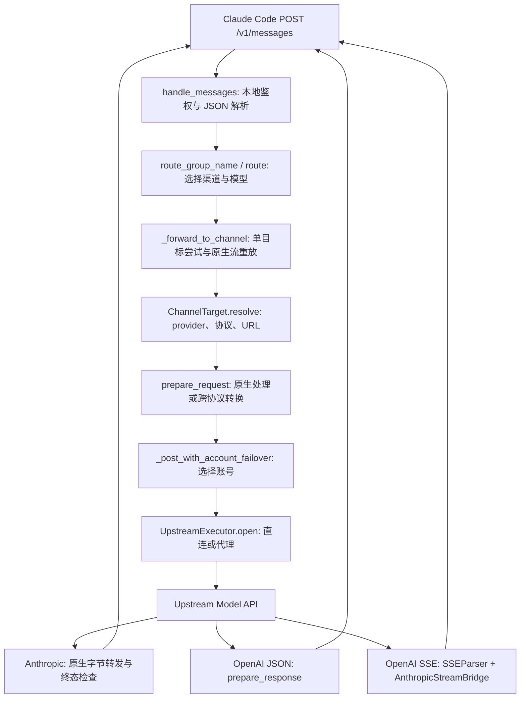

# Claude-Hub：真实请求链路与代码导读

> 基线：2026-09-08，首次分析基于 `9dfe055`；现已修正 npm 随包依赖并提取纯路由，见 S21。
> 失效条件：入口、路由优先级、协议边界或重试条件发生变化时同步更新；路径迁移后按符号重新核对。
> 这是现行实现的阅读地图。后续执行任务只从 [work-queue.md](work-queue.md) S21 及其引用卡领取。

## 1. 项目定位与阅读范围

Claude-Hub 是面向 Claude Code 的本地 Model / Protocol Gateway。它把客户端的
Anthropic 风格请求路由到配置的渠道，按需转换为 OpenAI Chat Completions 或 Responses，
再把 JSON 或 SSE 响应转换回来。`claude1` 是配套的会话启动器。

网关转换工具调用的声明、参数、结果和标识，不执行工具。Agent Loop、决定何时调用工具、
工具执行、上下文压缩、权限和 sandbox 由客户端负责。启动器有会话隔离和恢复路由记录，
这不等于实现了 Agent Session 引擎；模型窗口配置也不等于 Context Management。

本次沿根 Python 运行时的真实调用点检查代码，同时检查安装入口、管理面接缝、协议测试和
Go 实验的终态规则。没有逐行审查两端 UI，也没有对真实渠道做端到端验证。

## 2. 当前结构：先辨认哪条路径在运行

| 位置 | 当前实际职责 | 阅读顺序 |
| --- | --- | --- |
| `claude-hub.py`（约 4,500 行） | HTTP 服务、配置与 provider 数据库的路径/权限/读取时机、上游调用编排、原生流转发、错误与用量日志、CLI | 主线第一站 |
| `claude1_routing.py`（约 200 行） | 模型选择器、route 组名与渠道匹配；只接收配置和 provider 快照，不读 DB | 从 handler 的 route 调用进入 |
| `claude1_hub_config.py`（约 390 行） | Hub 配置解释：`validate_config()` 与渠道/槽位/routes 校验；接收 raw、快照与环境映射，不做任何读取 | 读配置相关问题的第一站 |
| `claude1_providers.py`（约 400 行） | provider 行解析、只读快照复制、`ProviderSnapshotCache`（条目、锁、single-flight、指标）；不解析路径、不做权限策略 | provider/快照问题的第一站 |
| `claude1_protocol.py`（约 7,000 行） | 请求转换、响应转换、能力与降级判定、SSE 解析和流状态机 | 跟随协议分支读 |
| `claude1_protocol_errors.py` | 上游错误体 → 脱敏后的 (code, message) 证据与 Anthropic 错误壳；凭证脱敏规则的唯一所有者 | 读错误归因时进入 |
| `claude-provider-once.py`（约 7,710 行） | provider 选择、settings、Hub/bridge 生命周期、Hub 配置编辑、TUI 操作与按键、CLI、会话路由记录 | 先读启动路径，后读 TUI |
| `claude1_terminal.py`（约 100 行） | 终端显示宽度与窗口安全绘制；无状态、不读配置，`curses` 缺失时仍可导入 | 读启动器 TUI 前先看 |
| `claude1_launcher_view.py`（约 500 行） | curses 调色板状态（`C`/`logo_pairs`/`row_pairs`）、logo 与开场动画、只吃现成数据的面板；不读配置/凭证、不探活、不启动 | 同上 |
| `claude1_transport.py` | 直连/代理候选解析和 HTTP 打开阶段的切换 | HTTP 发送的最终入口 |
| `claude1_account_pool.py` | 账号选择、禁用、冷却、非密钥状态持久化 | 按需读 |
| `claude1_protocol_types.py`、`claude1_protocol_usage.py` | 协议数据类型与错误；统一 usage 来源和转换 | 应保留的现有边界 |
| `claude1_context_window.py`、`claude_hub_catalog.py`、`claude1_usage_report.py` | 模型窗口判定、命名 Hub 目录、用量汇总 | 周边能力 |
| `scripts/`、`install.sh`、`bin/model-bridge.js` | shell 集成、安装、npm 到 Python 的启动转交 | 理解实际交付入口 |
| `src/claude_hub/` | 新 Python 包的管理接口、CC Switch/Standalone store、凭证存储和启动流程 | 与根运行时分开读 |
| `crates/agent-hub/` | Rust CLI/TUI 管理面；当前 CLI 提供 provider list/current | 不在 Python 请求热路径 |
| `UI/macos/`、`UI/windows/` | 两套独立桌面构建；启动路径可调用 Python，对话经 Rust 侧 reqwest 调本机 hub 的 `/v1/messages`（前端不直连，CSP 挡着） | 会真实产生 hub 请求与流水，不再是纯展示层 |
| `gateway/` | 独立 Go 代理/协议转换实验 | 不计入主 Python 协议实现 |
| `tests/`、`examples/`、`docs/` | 隔离测试与流 fixture、无凭证配置示例、设计/证据/工作队列 | 与主线交叉阅读 |
| `tools/freebuff-src/`、`tools/go-sdk/` | 外部参考和本地工具 | 非仓库产品模块 |

两个容易读错的名字：`src/claude_hub/routing.py` 选择 Companion/Standalone 等启动模式和
首屏，模型请求路由在 `claude1_routing.py`；`claude-hub.py::handle_fallback()` 是未知 HTTP 路径的 404 handler，
不负责模型 fallback。

`pyproject.toml` 声明的 `claude-hub` / `claude1` console scripts 指向
`src/claude_hub/entrypoints.py`，目前只实现 help/version，操作命令返回退出码 2。
不能把这两个已声明的命令当成已打包的根运行时。`switchctl` 则有实际管理与启动逻辑。

## 3. 启动链：Claude Code 为什么会把请求发给 Hub

### 多渠道 Hub

`scripts/zsh-functions.sh::claude1()`（或 `bin/model-bridge.js::main()`）
→ `claude-provider-once.py::main()`
→ `exec_hub()`
→ `resolve_hub_ref()` / `load_hub_config()` / `ensure_hub()`
→ `launch_with_settings()`
→ `_run_claude()`。

`exec_hub()` 选择初始模型与槽位，把本次会话的 `ANTHROPIC_BASE_URL` 设置成 Hub 回环地址，
注入本地 Hub token 和四槽位模型映射。`launch_with_settings()` 写入权限 `0600` 的临时
settings，调用真实 Claude CLI 的 `--settings`，退出后删除该临时文件。

服务自身入口是 `claude-hub.py::main()` 的 `serve` 分支：
`run_server()` → `get_config()` / `get_providers()` → `create_app()` → `web.AppRunner`。
监听地址固定为 `127.0.0.1`，或接管启动器传入并验证过的回环监听 socket。

### 单渠道的两个分支

`claude-provider-once.py::launch_provider()` 读取协议和 transport：

- Anthropic + direct：`launch_with_settings()` → Claude Code 直接访问配置的上游，不经过本 Hub。
- 需要协议转换或非 direct transport：`launch_with_protocol_bridge()` →
  `_acquire_protocol_bridge()` / `_ProtocolBridgeSupervisor` → 同一 `claude-hub.py` 运行时。
  `_write_bridge_config()` 生成单渠道配置，启动器再把 Claude Code 指向本地桥。

协议桥可按 provider/协议/transport 复用常驻进程；不能继续描述为每次会话退出必然销毁的短命桥。

## 4. 完整请求调用链



| 步骤 | 文件与关键符号 | 实际行为 |
| --- | --- | --- |
| HTTP Endpoint | `claude-hub.py::create_app()` | 注册 `/v1/messages` 和 `/v1/messages/count_tokens` 到同一 handler；另有 models、healthz、readyz |
| Request Parser | `claude-hub.py::handle_messages()` | `get_config()`、`check_local_auth()`；拒绝不支持的请求压缩，读 JSON，验证 model 与 JSON 数值/字符合法性 |
| Provider snapshot | `claude-hub.py::get_providers()` → `claude1_providers.py::ProviderSnapshotCache.load()` | 通过线程调用读取快照；`get_providers()` 解析路径、校验 0600 并给出观察到的版本，缓存条目、锁、single-flight 与指标全部归 `_provider_snapshot` 所有；DB/WAL 指纹命中时复用，变化时只读刷新 |
| Router | `claude1_routing.py::route_group_name()` / `route()`，由 Hub 显式导入 | 显式 route 组给出有序目标列表；普通模型选择得到 `(channel_alias, model_out)` |
| 单目标编排 | `claude-hub.py::_forward_to_channel()` → `_forward_to_channel_attempt()` | 每次目标尝试独立处理 payload，外层接收可重放原生流异常 |
| Provider 解析 | `claude-hub.py::ChannelTarget.resolve()` → `resolve_provider()` | 渠道映射到 CC Switch 记录，校验 token/URL/transport，应用渠道协议覆盖 |
| Request Adapter | `claude1_protocol.py::prepare_request()` | 原生协议默认经 Hub 传入 passthrough；OpenAI 路径解析 RequestIR 后进入对应 request adapter |
| 上游请求准备 | `claude-hub.py::_handle_transformed_messages()` 或 `_forward_to_channel_attempt()` | 序列化请求、构造协议对应 URL/鉴权头、设置 `connect=15, sock_read=600, total=None`；转换入口的 `ChannelTarget` 与账号池由 `_forward_to_channel_attempt()` 传入，入口自身不再重建 |
| Account selection | `claude-hub.py::_post_with_account_failover()` → `_RequestAccountPool.acquire()` | 取得账号 lease；成员贡献凭证，主 provider 决定 endpoint/模型/协议 |
| 实际 HTTP 发送 | `claude1_transport.py::UpstreamExecutor.open()` | 调用 `aiohttp.ClientSession.request(method, url, ...)` 并进入请求上下文；此处才发往上游 |
| JSON 返回 | `claude1_protocol.py::prepare_response()` 或原生 handler | OpenAI 响应转回 Anthropic message；原生响应通常保留上游字节，错误有专门处理分支 |
| Stream 返回 | `claude-hub.py` 流循环 + `claude1_protocol.py::AnthropicStreamBridge` | 原生检查终态并转发；跨协议解析事件、转换并写出 Anthropic SSE |
| 下游交付 | `web.json_response()` / `web.Response()` / `web.StreamResponse.write()` | 返回给 Claude Code；成功用量与失败证据分别进入 usage/errors journal |

`prepare_request()` 自身的 `native_system_role_mode` 默认是 `promote`，但 Hub 的
`ChannelTarget` 默认明确传入 `passthrough`。阅读默认参数时不能忽略实际调用方。

## 5. Router、模型和 Provider 究竟怎么选择

Router 本质是按显式配置解析模型选择器，不是根据 prompt 内容做智能分类。
`handle_messages()` 先识别 `route:<name>`；配置有 routes 时，从组内 targets 按顺序取目标。
普通 `route()` 的顺序是：

1. 去掉可选 `anthropic/` 前缀；显式 `channel,model` 直接指定渠道和上游模型。
2. 裸槽位名先查 Hub `model_slots`。
3. 在各渠道声明的 models 中找唯一精确匹配；多匹配报歧义。
4. 尝试恢复客户端去掉的 `[1m]` 声明；多匹配仍报歧义。
5. 未声明的 `claude-<tier>-...` 名称尝试映射 Hub 槽位，或单渠道桥的 provider tier。
6. 默认渠道的 provider 槽位映射；仅显式 `route_unknown_to_default` 才透传未知模型，否则报错。

可以在仓库目录的 Python 中独立练习，不启动服务、不读数据库：

```python
from claude1_routing import route

config = {
    "default_channel": "primary",
    "channels": {"primary": {"provider": "id:demo", "models": ["demo-model"]}},
}
providers = {"id:demo": {"model_map": {"haiku": "demo-fast"}}}
assert route("primary,demo-model", config, providers) == ("primary", "demo-model")
assert route("haiku", config, providers) == ("primary", "demo-fast")
```

先改输入 selector，再改 model_map，最后加入另一个声明同名模型的渠道观察歧义错误。
这几个操作分别对应“显式选择”“槽位映射”和“不能猜测的配置歧义”。

`resolve_provider()` 通过 `claude1_routing.py::match_channel_provider()` 按渠道 `provider`
selector 取记录：稳定 `id:<id>` 或唯一名字；旧配置还可按唯一规范化 URL 匹配。
`claude1_providers.py::_read_provider_rows()` 从 CC Switch 中 `app_type='claude'` 的行构建
包含 endpoint、token、api_format、model_map、transport 的运行时 dict；单行读不出来就跳过，
不修补也不猜测。

协议来源由 `claude1_protocol.py::provider_api_format()` 解释：显式 override 优先；
`codex_oauth` 类型推到 Responses；其后是 `meta.apiFormat`、旧 settings 字段与兼容标记；
默认 Anthropic。Hub 再应用渠道的 `api_format` 覆盖。协议判定不等于实现了完整 OAuth 登录/刷新。

目前没有“每个供应商一个 Provider 子类”的体系。Provider 是连接与凭证配置，Protocol Adapter
负责数据形状，Transport 负责如何连过去。新增一个已有协议的渠道通常只需配置；新 wire 协议才
需要增加请求/响应/流适配、能力声明和测试。Gemini 在 registry 中只是 reserved，不是已支持。

## 6. Anthropic、Chat、Responses 与 Tool Call

| 内容 | Anthropic 输入 | OpenAI Chat 输出 | OpenAI Responses 输出 |
| --- | --- | --- | --- |
| 系统指令 | 顶层 `system` | `messages` 的 system 消息 | `instructions` |
| 对话 | `messages[].content` blocks | `messages` 的内容、工具调用及 tool 消息 | `input` 的消息、function_call、function_call_output items |
| 工具定义 | `tools[].input_schema` | `tools[].function.parameters` | function 工具的 `parameters` |
| 模型请求调用工具 | assistant `tool_use`，`input` 为 JSON 值 | assistant `tool_calls`，arguments 为 JSON 字符串 | `function_call`，保留 `call_id` |
| 客户端回传结果 | user `tool_result.tool_use_id` | `role=tool` + `tool_call_id` | `function_call_output.call_id` |
| token 上限 | `max_tokens` | 按模型使用 max_tokens/max_completion_tokens | `max_output_tokens` |

请求路径：`prepare_request()` → `_parse_request_ir()` →
`anthropic_to_chat(request_ir, ...)` / `anthropic_to_responses(request_ir, ...)`；
后者的消息转换在 `_responses_input()`。两个编码函数直接消费 RequestIR，
不再经 dict 还原，`_payload_from_request_ir()` 已删除；`_IR_ENCODED_FORMATS`
列出走 IR 的两种协议，`codex_oauth` 方言只在 Responses 分支由 `provider_type` 解析。
把一条 IR 消息渲染成编码器读的形状由 `_message_content_for_encoding()` 独占：
客户端发的字符串 content 必须原样保留，因为 Responses 对字符串和 block 列表
输出不同（裸 `content` vs `input_text` 部件）。

JSON 返回：`prepare_response()` → `_RESPONSE_DECODERS[api_format]`
（直接就是 `chat_to_anthropic()` / `responses_to_anthropic()`）→ `(payload, receipt)`，
由 `prepare_response()` 组装 `PreparedResponse`，把上游函数调用转回 `tool_use`。

跨协议的 `_validate_tool_result_causality()` 要求工具结果引用更早、唯一、尚未消费的工具调用。
它由 `_parse_request_ir()` 在返回 IR 前调用一次（唯一所有者），两个编码器共享同一结论，
不再各自复检。这是真实的因果保护，应保留；不要把“默认宽容”解释成允许错配工具 id。
原生 passthrough 不走完整 RequestIR 校验链，不能宣称所有路径使用完全相同的入站校验。

流式参数可能被拆在任意 chunk 中。`AnthropicStreamBridge::_tool_start()` 建立 block，
`_tool_delta()` 输出 `input_json_delta.partial_json`，`_tool_snapshot()` 对照累计片段去重或拒绝冲突。
客户端收到这些数据后执行工具，再把结果放进下一次请求；Hub 本身没有 Tool Execution。

## 7. Streaming 为什么复杂：两条不同路径

**OpenAI 转换流**在 `_handle_transformed_messages()`：
上游字节 → `_SSEContentDecoder` 解压 → `SSEParser.feed()` 跨 chunk 切事件并解 UTF-8 →
`AnthropicStreamBridge.feed()` → `_feed_chat()` / `_feed_responses()` → Anthropic SSE bytes →
`response.write()`。`StreamStateMachine` 管 message、block、delta、终态的顺序。
桥还处理工具参数增量与完整快照、thinking、usage 晚到、id 与重复终态。

`bridge.finish()` 必须看到受支持的上游终态证据，普通 EOF 不能变成功。
Chat 的裸 `[DONE]` 是已实现的兼容例外：缺 finish_reason 时推导中性结束原因并记录降级；
这与完全没有终态的断流不同。客户端要 SSE 而上游返回完整 JSON 时，代码也可由已完成 JSON
合成一次性 Anthropic SSE，不应与“给断流伪造成功”混淆。

转换流较早执行 `response.prepare()`，之后转换失败写 `error` 事件或中止连接，不进入原生流的
延迟提交重放策略。真实终态已发出时不追加第二个终态。

**原生 Anthropic 流**在 `_forward_to_channel_attempt()`：原始 chunk 转发，解压后的旁路数据
用于 `_SSETerminalTracker` / `_SSEUsageTracker`，不把整个流重新编码。
`_DeferredDownstream` 暂存尚未交付的前奏/思考内容：当前思考扣留上限 1 MiB / 45 秒；
首 chunk 等待超过 20 秒由 `_FirstChunkGuard` 中止尝试。真实内容到来或扣留边界到达就开始交付。
未交付时的部分断流可重放；开始交付后不能悄悄换掉客户端已经见到的回答。
缺终态的正常 EOF、读停滞等分支会发明确 error，另一些传输错误直接 abort；并非所有断流都可渲染为 error。

## 8. 错误、Retry、Fallback 分属四层

| 层与 owner | 已实现的触发与结果 | 边界 |
| --- | --- | --- |
| 网络路径：`UpstreamExecutor.open()` | 打开 HTTP 响应阶段的特定连接/超时/OSError 尝试下一个直连/代理候选；调用方还允许 403/451 切路径 | 尚未拿到响应不代表上游没收到请求，不能承诺没有重复推理或计费 |
| 账号：`_post_with_account_failover()` / `AccountPool.report()` | 管理池内 401/403 禁用、429 冷却，排除本次已试账号后换号；保留最终拒绝响应 | 不是通用 5xx 重试，也不是按内容选备用模型 |
| 原生流重放：`_forward_to_channel()` | 捕获 `UpstreamStreamReplayable`，最多额外 2 次；耗尽返回本地 504，有 route 组时可继续下一目标 | 条件是下游尚未开始交付，不是上游尚未执行；转换流没有同等重放机制 |
| 路由组：`handle_messages()` | 捕获 `RouteTargetExhausted` 后推进 target；通常来自 401/403/429，另包括本地池耗尽和原生流重放耗尽 | 普通上游 5xx 不自动切 provider；这里的本地 503/504 要与上游 HTTP 5xx 区分 |

HTTP 尚未交付时，配置/DB 不可用由 `controlled_error_middleware()` 映射为 503；JSON/请求
不合法通常 400，转换失败通常 502。跨协议上游错误经 `claude1_protocol_errors.py::transform_error()` 整形成 Anthropic
错误体；原生路径通常保留上游响应，部分状态有安全错误整形。SSE 已交付后不能再改 HTTP status，
只能发协议错误事件或终止连接。`record_error()` 与 `record_usage()` 记录脱敏证据及用量来源。

已有 S20 指出下游写失败可能被原生重放路径误归因成上游失败；本次核对其条件仍在，未在真实
客户端复现，不能把重放边界写成完全无缺口。详细修复合同继续使用现有 S20，不另建重复卡。

## 9. 配置来源与边界

| 数据 | 入口与默认来源 | 作用 |
| --- | --- | --- |
| Hub 配置 | `config_path()`：`CLAUDE_HUB_CONFIG` 或 `~/.cc-switch/claude-hub.json`；`claude-hub.py::get_config()` → `claude1_hub_config.py::validate_config(raw, providers, env=...)` | channels、routes、slots、端口、transport；`get_config()` 是唯一读取者（路径、权限、缓存、按需读 provider 库），`validate_config()` 只解释传入的 raw/快照/环境映射 |
| 上游配置与凭证 | `db_path()`：`CLAUDE_HUB_DB` 或 `~/.cc-switch/cc-switch.db`；`get_providers()` | SQLite mode=ro、进程内快照；与无凭证的界面 DTO 区分 |
| 本地鉴权 | 配置 `local_token_env` 指定的环境变量，优先于兼容字段 `local_token` | Claude Code 到 Hub；不是上游 key |
| 网络路径 | `channel_transport_policy()` | 渠道 transport → 渠道旧 proxy → provider transport → provider proxy → Hub 旧 proxy → Hub transport |
| 账号池 | `CLAUDE1_ACCOUNT_POOL_CONFIG` / `CLAUDE1_ACCOUNT_POOL_STATE` 或 `.cc-switch` 下池 JSON / 状态 SQLite | 只保存成员引用、指纹、冷却与选择状态 |
| 启动器与命名 Hub | `claude-provider-once.py` 的 load_config/load_hub_config/load_hub_catalog | 别名、会话启动偏好、Hub 实例和槽位；不全属于每请求配置 |
| Standalone | `src/claude_hub/standalone.py` + `credentials.py` | 独立 profile 元数据与系统凭证库，不是根 Hub 的 provider 来源 |

读取与解释的时序是合同，因为 `handle_messages()` 先 `get_config()` 再 `check_local_auth()`：
解析 `CLAUDE_HUB_CONFIG` → 校验 0600 权限与 `stat()`（失败即 `ConfigError`）→ 路径/mtime/大小
变化时才重读并解析 JSON → **仅当** raw 里有声明 `requires` 的 route 组才读 provider 库
（因此未鉴权请求也只在这一种情况下触达 DB）→ `validate_config()` 不再做任何读取。
`validate_config()` 的报错顺序同样未变：root → version → instance_id → channels → default_channel
→ routes → v2 槽位/effort → local_token_env/local_token → proxy → transport → port。

多种配置承担不同职责，本身不是缺陷；同一事实在启动器、网关与 UI 被分别解释，才会产生漂移。
不能为“配置集中”把上游 key、展示 DTO、账号调度状态混进一个总配置对象。

## 10. 最影响理解、维护与展示的事实

| 优先级 | 证据与影响 | 判断 |
| --- | --- | --- |
| 已处理：交付闭包 | npm `package.json.files` 原漏掉启动器直接导入的 `claude1_context_window.py`，隔离产物的 launcher `--help` 报 ModuleNotFoundError；现已补齐，并用真实 tarball 验证 | 修复前失败、修复后通过；未重新发布，不外推到所有历史已发布版本 |
| 先对齐支持边界 | root runtime、占位 console scripts、Standalone、Rust 管理面、Go 实验同时存在；`routing.py` 又有两种含义 | 不只是名字不好看，而是读者会找到错误入口 |
| 先对齐失败语义 | native 与 transformed 的流提交和重放不同，重试规则分布四层；S20 尚未闭环 | 应先固定行为表和场景测试，再抽取共用代码 |
| 先区分协议实现 | Go `repair.Machine.Finalize(cleanEOF)` 会追加 end_turn/message_stop；主 Python 在缺终态时报告失败 | 两者不能共用“失败不伪装”展示口径；没有证据支持直接删除整个 Go 实验 |
| 展示前检查 Standalone | `launch_standalone_session()` → `IsolatedClaudeSession._build_settings_payload()` 把 profile URL 直接设为 Anthropic base URL，未按 adapter 启动 bridge | 存在 OpenAI adapter 枚举不代表启动路径已完成协议接入；未跑真实上游 |
| 凭证处理风险 | `MacOSKeychainStore.set_secret()` 把 secret 作为 `security ... -w` 的 subprocess argv 参数 | 代码事实与“不进 argv”口径冲突；本次没有读取真实 key，也未证明已发生泄露 |
| 三个文件职责过重 | Hub 混配置/快照/网络/流/日志/CLI；launcher 混 TUI/配置/进程；protocol 混请求/响应/流状态 | 按控制流责任拆分有价值，单纯缩短行数没有价值 |
| 接口绕行与数据复制 | 请求 payload → RequestIR → provider payload（中间那层 dict 还原已删除）；原 route() 的隐式读库已移除，现在必须传入快照 | 已让路由依赖显式；去掉一次深拷贝是可读性收益，未做性能测量，不能称深拷贝曾是瓶颈 |
| 文档漂移 | README 原测试数 718，本次 959；启动器模块头称仅环境变量，实际有临时 settings；旧设计文档还描述短命桥或待建 fallback | 源码、现行导读与历史设计需要分清；本轮未全面重写历史文档 |

安全方面已看到回环监听、本地 token、只读 DB、文件权限检查、上游 URL 限制、禁止请求重定向和
错误脱敏。不能据此宣称完成安全审计；尤其“网关不持久复制上游 key”和“启动器完全不写 key”
不是同一个承诺，后者与临时 settings 的实际实现不符。

测试并不缺总量：修改前 Python 全量 959 项通过；补充 2 个 npm 产物测试、6 个路由匹配/快照
测试后全量 967 项通过。此次安装脚本 6 项通过，两名 Astra 分别复核路由等价与交付依赖。
已有 `test_protocol_contract`、`test_claude1_protocol`、`test_protocol_sse_invariants`、
`test_claude_hub`、`test_routes`、`test_transport`、`test_account_pool` 等，并有 fixture 和本地
HTTP 场景。缺口是产物级启动、未接通路径和已知边界场景，不是重新建立一整套测试体系。
通过测试不代表测试覆盖率已测，也不代表 UI、Rust、Go、真实 provider 或安装态全部通过。

## 11. 保留、重构、合并与删除的判断

**保留**：根 Python 作为唯一主协议运行时；三种协议分支；显式编码/解码分发表；工具因果检查；
SSE 状态机、增量 parser 与 usage receipt；`ChannelTarget`；现有 transport/account pool 边界；
原生系统消息 passthrough 与显式 promote；本地鉴权、私有文件、脱敏和隔离测试。
这些抽象分别解决格式差异、乱序/重复、计数来源、目标事实聚合和账号状态问题，有明确用途。

**已完成的小步拆分**：启动器的终端排版与安全绘制已移到 `claude1_terminal.py`：
`safe_addstr()` / `compose_row()` / `pad_display()` / `truncate_display()` / `display_width()`
按显示列而不是 `len()` 计算宽度，并把越界写入裁剪掉；字符宽度与负偏移裁剪成为该模块内部实现，
启动器不再需要知道。启动器按原名 import 重导出，调用点与测试注入点不变。

调色板与品牌绘制随后移到 `claude1_launcher_view.py`。该模块是 `C`、`logo_pairs`、
`row_pairs` 的唯一所有者，`init_colors()` 是唯一写入者且**原地改写**这三个对象、不重新绑定，
所以 `from claude1_launcher_view import C` 的绑定长期有效；`_launcher_main()` 不再用
`global C` 二次发布。随之迁移的还有 logo/开场动画（`draw_logo()`、`intro()`、
`logo_intensity()`）、终端能力判定（`tui_size_supported()`、`large_logo_supported()`、
`animation_enabled()`）、列表滚动窗口（`visible_window()`）和三个只接收现成文本的面板
（`draw_provider_quick_panel()`、`draw_hub_wizard_shell()`、`draw_hub_wizard_options()`）。
view 不读 Hub 配置、CC Switch 行或 token，不探活也不启动。

`_draw_launcher()`、`_draw_hub_workspace()`、`_draw_hub_setup*()` 仍留在启动器：它们要解释
`HUB_CATALOG_ENABLED`、`HUB_SLOT_ORDER`、provider 覆盖与兼容徽章，并依赖 `HubStatus` /
`HubChannel` / `HubSlotOption` 等启动器数据类。把它们搬进 view 需要反向 import 或另建一套
"已备好的行"数据模型，超出本步范围。

Hub 的 selector 路由已移到 `claude1_routing.py`。`handle_messages()`
先取得快照，再调用 `route(model, cfg, providers)`；路由不再可以自行读库。内部 Python 函数的
第三个参数改为必填，仓库调用与测试已同步；HTTP 请求、优先级与错误语义保持不变。
`match_channel_provider()` 同迁，配置能力检查、provider 解析与 CLI 使用同一个匹配实现。
对照 cc-switch `proxy/model_mapper.rs` 的“模型映射独立于转发”边界；保留本项目已有显式渠道、
四槽位和歧义处理，而不照搬其默认兜底规则。

转换路径的入口依赖也已收敛：`_handle_transformed_messages()` 现在必须收到已解析的
`target: ChannelTarget` 和 `account_pool: _RequestAccountPool`，不再接收与 target 重复的
`provider/alias/model_in/model_out`，也不再在缺参数时自行 `from_provider()` 或建空账号池。
准备目标与账号池的唯一位置是 `_forward_to_channel_attempt()`；直接调用该入口的测试改用同一套
准备路径。URL、模型、凭证来源、调用次数与 JSON/SSE、转换拒绝、错误归因、用量行为不变。

配置的读取与解释也已分家：解释部分整体移入 `claude1_hub_config.py`（`ConfigError`、
`validate_config()`、渠道/槽位/routes 校验、`ENV_PORT`/`ENV_LOCAL_TOKEN` 的定义都在那里，
`claude-hub.py` 重新 import 回来），读取、0600 校验、原始 JSON 缓存和「是否需要 provider
快照」的判断留在 `claude-hub.py::get_config()`。解释模块不 import 主运行时，因此作用域里
没有任何能打开配置文件或 provider 库的名字。读取缓存本身没有跟着搬：`get_config()` 依赖
`get_providers()`，而快照状态的归属属于 S21-P4，先搬会制造反向依赖。

Provider 快照同样分家：`claude1_providers.py` 拥有行解析、只读快照复制和
`ProviderSnapshotCache`（唯一持有缓存条目、两把锁与五个计数器；日志器由 Hub 注入，
与 `UpstreamExecutor(log=...)` 同一写法）。`claude-hub.py::get_providers()` 留下的是
读取者职责：解析 `CLAUDE_HUB_DB`、`_resolve_database_path()`、0600 校验、
给出观察到的版本，并把「读取 + 复查权限」打包成 `_refresh_provider_snapshot()` 交给缓存。
0600 校验没有随缓存迁走，因为 `_require_private_file()` 同时服务配置文件，
把它搬进 provider 模块会让配置校验反过来依赖 provider 模块。
`reset_caches()` 只调用 `_provider_snapshot.reset()`。

**后续适合小步拆分**：确定配置/快照唯一 owner；
把 `_draw_launcher()` 等剩余绘制改为接收已备好的行数据后再移出启动控制流；
最后按请求、响应、流转换拆 protocol。
每次迁移一个责任，入口保持兼容，保留 API 与测试合同；原生/转换流暂不强行合成一条算法。

**合并候选**：Hub 和 launcher 对同一配置字段的重复规范化；多处 provider 格式判断应继续复用
`provider_api_format()`；请求转换中的 IR → dict 过渡已删除（编码器直接读 IR，
校验、降级记录、错误 code/path 与工具关联保持不变）。
管理面脱敏读取和运行时含凭证读取不同，不能仅因为都查 SQLite 就合并成一个万能 store。

**删除候选**：失真的重复说明、无调用且不属于导出合同的兼容别名/包装；先查引用、安装清单、
测试和外部命令入口再删。原来的两层 adapter 薄类（`RequestAdapter`/`ResponseAdapter` 及四个子类、
两张实例表）已被普通函数与显式分发表取代：它们无状态、`api_format` 类属性无人读取、
每个方法只转交一次调用，不构成真实接缝。
本轮没有证明可安全删除的运行时模块；不删除 Go 实验、平台 UI、旧入口或历史排除证据。

## 12. 推荐目标结构与阶段

这是逐步迁移方向，不是本次已建成的目录，也不要求一次搬迁：

```text
claude-hub/
├── claude-hub.py                 # 迁移完成后保留兼容启动薄壳
├── claude-provider-once.py       # 同上，保留现有安装调用方式
├── src/claude_hub/
│   ├── entrypoints.py            # 先接通真正运行行为，才能成为正式入口
│   ├── runtime/
│   │   ├── server.py             # HTTP 生命周期与请求编排
│   │   ├── routing.py            # 纯 selector → target，不读 DB
│   │   ├── providers.py          # 根运行时 provider 读取/快照/目标解析
│   │   ├── config.py             # Hub 配置校验与读取
│   │   ├── transport.py          # 沿用现有网络执行模块
│   │   ├── account_pool.py       # 沿用现有账号调度模块
│   │   └── protocol/
│   │       ├── requests.py       # 入站验证与请求适配
│   │       ├── responses.py      # 完整 JSON 响应适配
│   │       ├── sse.py            # 事件解析与跨协议流状态
│   │       ├── types.py          # 沿用当前错误与中间类型
│   │       └── usage.py          # 沿用统一用量来源
│   ├── launcher.py              # 会话启动与 bridge 生命周期
│   ├── launcher_tui.py          # 已存在的 TUI 交互
│   └── ...                      # 现有管理/store 模块，按需迁移、不复制
├── tests/                       # 保留按可观察合同组织的测试与 fixtures
├── docs/request-flow.md         # 当前实现地图
├── docs/work-queue.md            # 唯一执行顺序与验收合同
├── examples/                    # 可复现且无真实凭证的配置
└── scripts/                     # 安装、诊断与交付检查
```

UI、Rust 管理面和 Go 实验保持各自边界；图中未展开不代表删除。
不先造 `errors/`、供应商子类树、DI 容器、自动注册系统。原生流的网络 IO 初期仍由 server 编排，
确认独立测试边界后才决定是否另拆文件。搬到 src 前须同时解决 Python/npm/install 的依赖打包，
否则目录变整齐但现有脚本会导入失败。

后续执行以 [work-queue.md 的 S21 六个计划](work-queue.md#s21--面向学习与求职展示的渐进整理)
为唯一来源：主链入口 → 协议错误与转交 → 配置 → Provider 快照 → 启动器显示 → 请求/响应规则。
该顺序替代早期“先整块搬 TUI”的设想。每个计划有独立范围、排除项、前置条件、验证合同和停止点；
目前只保存计划，等待之后逐项分析与操作。上方目标目录是远期示意，整库迁移 src 不在这六个计划内。
已知运行缺口沿用原卡，协议结构整理不顺带改变重试或放宽保护。

## 13. 面试时如何解释

- **解决什么问题，为什么要 Gateway？** Claude Code 发送 Anthropic 风格请求，而渠道的模型名、鉴权配置和 API 格式不同；Hub 提供稳定客户端入口与显式配置路由。
- **Router 是什么？** 选择器到渠道/模型目标的规则解析；route 组额外规定故障时的尝试顺序，不理解任务语义。
- **Provider 抽象解决什么？** 把连接事实与凭证来源聚合，使请求转换不用自己查 DB；当前主要用 dict 和 ChannelTarget，不必包装成供应商类层级。
- **协议差异在哪里？** Anthropic content blocks 与 OpenAI messages/input 的结构、tool result 载体、结束原因及 usage 语义不同；不是改 URL 和 model 字段就够了。
- **Tool Call 怎么工作？** Hub 保留调用 id，把调用声明和参数转换给客户端；客户端执行工具，结果下一轮带回，Hub 校验并转换关联关系。
- **Streaming 为什么难？** 网络 chunk 不等于事件，事件增量不等于完整结果；必须保持工具 id、block 顺序、终态和 usage 一致，还要处理下游已经看见内容后的失败。
- **Fallback 如何实现？** 网络路径、账号、原生流重放、route 目标四层分别负责；不能把客户端尚未看到内容等同于上游没有推理。
- **为什么拆文件？** 让路由只做选择、协议只转形状、网络层只管理连接，测试能在相应边界证明行为；当前三巨文件还没完全达到这个目标。
- **与 Harness 的区别？** Gateway 处理模型通信，Harness 负责围绕模型运行工具与循环；本项目不声称拥有 Agent Loop 或 Sandbox。
- **新增 Provider 改哪里？** 已有 wire 协议通常配置渠道和模型即可；新协议需要 request/response/SSE adapter、能力矩阵、协议与集成测试。
- **最大限制？** 当前主网关依赖 CC Switch 的 Claude provider 数据；多条启动与实验路径未统一，协议兼容也不等于模型能稳定完成 Claude Code 的任务。

这些回答只描述已读代码，不将规划、历史设计或演示 UI 当成已交付能力。
